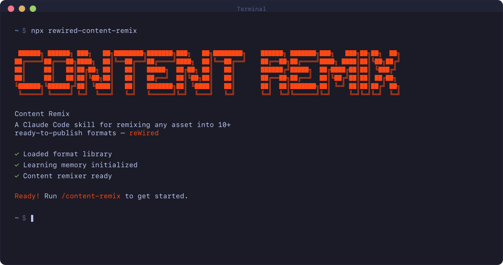

<div align="center">



### CONTENT REMIX SKILL
**A Claude Code skill for content strategists and digital marketers.**

*One asset. Every format.*

<br>

&nbsp;&nbsp;

<br>

`/content-remix` &nbsp;·&nbsp; `/content-remix-setup` &nbsp;·&nbsp; `/content-remix-reset-memory`

</div>

---

**Mac / Linux**

```bash
mkdir -p ~/.claude/commands && curl -fsSL https://raw.githubusercontent.com/drew-rewired/content-remix/main/content-remix-skill.md -o ~/.claude/commands/content-remix.md
```

**Windows**

```powershell
curl.exe -fsSL https://raw.githubusercontent.com/drew-rewired/content-remix/main/content-remix-skill.md -o "$env:USERPROFILE\.claude\commands\content-remix.md"
```

Restart Claude Code. Onboarding starts automatically.

---

## What this is

A Claude Code slash command skill that takes any existing content asset and remixes it into every channel and format you need. Drop in a URL, upload a PDF, or paste in text — the skill walks through a pre-run workflow to lock in format, audience, channel intent, and research mode before generating anything.

It learns your voice over time through a memory system that logs approved outputs, tracks edit patterns (auto-applying them after three occurrences), and calibrates to your format preferences without you having to repeat yourself. It pulls industry-specific research when you want it, presents every source in a citation block for your approval before using it, and saves every job to a named output folder.

This is not a content creation tool. It is a content multiplication tool.

---

## Skill flow

Pairs with the **[Content Map Skill](https://github.com/drew-rewired/content-map)** — the map audits your full content program and tells you what to act on. Remix takes those assets and rebuilds them for every channel and format you need. They work independently, but together they close the full loop: see clearly, then act fast.

```
┌─────────────────────────────────────────────────────────────────────────┐
│  /content-map  ──  content audit + strategy                            │
├─────────────────────────────────────────────────────────────────────────┤
│                                                                         │
│  Integrations ──  GA4 · Google Search Console · Semrush               │
│                   (all optional — map runs without them)               │
│                                                                         │
│    ┌───────────────┬──────────────────────┬────────────────────┐       │
│    │ Full inventory│  Google Search       │  Single diagnostic │       │
│    │               │  Console             │                    │       │
│    └───────┬───────┴──────────────────────┴────────────────────┘       │
│            │                                                            │
│  ── audit ──────────────────────────────────────────────────────────  │
│   Layer 1  ──  Inventory                                               │
│   Layer 2  ──  Funnel mapping              TOFU · MOFU · BOFU         │
│   Layer 3  ──  Gating audit                                            │
│   Layer 4  ──  Performance triangulation   ◄── GA4 · Search Console   │
│   Layer 5  ──  Competitor gap analysis     ◄── Semrush                │
│   Layer 6  ──  EEAT / AEO / GEO scrub                                 │
│  ── strategy ───────────────────────────────────────────────────────  │
│   Layer 7  ──  Gap identification + citation approval                  │
│   Layer 8  ──  Repurposing check  (reposition before net-new)         │
│   Layer 9  ──  Output → content-map-report.md                         │
│                                                                         │
└─────────────────────────────────────────────────────────────────────────┘
                   │
                   │  content-map-report.md loaded automatically
                   ▼
┌─────────────────────────────────────────────────────────────────────────┐
│  /content-remix  ──  content generation                                │
├─────────────────────────────────────────────────────────────────────────┤
│                                                                         │
│  Input ──  URL · PDF · doc · image · transcript · brief                │
│                                                                         │
│   Gate 1    ──  Input detection + funnel stage                         │
│   Gate 1.5  ──  Output stage lock  (same · reposition)                │
│   Gate 2    ──  Output format  (12 options)                            │
│   Gate 3    ──  Subtype                                                │
│   Gate 4    ──  Organic or paid                                        │
│   Gate 5    ──  Audience confirmation                                  │
│   Gate 6    ──  Research mode + citation approval                      │
│   Gate 7    ──  Job name + pre-run confirmation                        │
│                                                                         │
│   Generation + EEAT / AEO / GEO review + Quality Gate                │
│                                                                         │
│  Output ──  blog post · landing page · white paper · ebook            │
│             email sequence · social posts · podcast script            │
│             presentation · infographic brief · video script           │
│                                                                         │
└─────────────────────────────────────────────────────────────────────────┘
```

---

## Who this is for

- **Content strategists** who want to maximize the reach of existing assets without adding production time
- **Digital marketers** running multi-channel programs who need format-native content for each channel
- **Email and social media managers** who are constantly pulling content from longer-form assets
- **Solo operators and small teams** without the bandwidth to reformat everything manually
- **Anyone sitting on a library of underperforming assets** that could be doing more across more channels

---

## Getting started

**First launch:** Onboarding begins automatically — no slash command needed. One detection question first:

> "Have you already documented your brand voice, audience, or ICP somewhere? If yes, share the doc, URL, or paste the text and I'll extract what I need."

If yes, the skill extracts brand voice, audience, and ICP directly. If no, it walks through six setup steps. The only required answer is your domain. Everything else is optional — skipped steps are flagged and setup keeps moving.

Configuration saves to `content-remix/content-remix-config.json` in your working directory.

**After setup:** Type `/content-remix` to begin. To update your configuration at any time, type `/content-remix-setup`. To clear your memory and start fresh, type `/content-remix-reset-memory`.

---

## How it works

Every job runs through seven gates before any content is generated:

| Gate | What it confirms |
|---|---|
| 1. Input | URL, PDF, pasted text, or Content Brief for net-new content. Detects funnel stage from source asset signals. |
| 1.5. Output stage | Lock funnel stage for the output — same as source, repositioned, or confirmed per format |
| 2. Output format | Which of 12 formats to produce |
| 3. Subtypes | Format-specific questions (landing page type, podcast format, email goal, platform, etc.) |
| 4. Channel intent | Where this content will live — paid vs. organic impacts structure and CTA density |
| 5. Audience confirmation | Loaded from config or overridden for this job (save as default or job-only) |
| 6. Research mode | Explicit choice before going online — research strongly recommended for Content Brief runs |
| 7. Job name | Confirms the output folder name before anything is written |

A pre-run summary block is shown before generation begins. Nothing is produced until you confirm.

### On return launches

| What's loaded | What it does |
|---|---|
| Config | Brand voice, audience, ICP, domain loaded silently |
| Memory | Auto-applied edit patterns listed; format preferences surfaced as defaults |
| Map context | If a Content Map report exists in the working directory, it is loaded for keyword context, funnel stage, and EEAT gaps |

---

## The twelve output formats

| Format | What it produces |
|---|---|
| Blog post | Full-length SEO-structured post with declarative H2/H3s, TL;DR block, short paragraphs, internal links, and meta description |
| Email | Single email or full sequence — goal and funnel stage confirmed before writing; each email has one job |
| Social posts | Platform-native posts for LinkedIn, X/Twitter, Instagram, or any channel — asks for platform and post count before writing |
| Landing page | Full page copy with hero, body sections, proof points, and CTA — asks for subtype before writing |
| White paper | Research-heavy, authoritative, citation-dense, 3,000–5,000 words. Executive summary, problem statement, analysis, recommendations. |
| Ebook | Educational, step-by-step, 2,000–4,000 words. Chapter-based structure with callouts, checklists, and visual breaks. |
| Podcast script | Solo or interview format; calibrated to target duration; verbal enumeration, no visual references |
| Presentation / slide deck | Slide-by-slide structure with speaker notes — asks for context and target length |
| Infographic brief | Content document for a visual designer: title, section breakdown, data points, suggested visual treatments, CTA copy |
| Video / explainer script | 5-sec hook, problem statement, solution narrative, proof points, CTA; written for spoken delivery |
| Optimize Original | Improved version of the same format — better structure, EEAT/AEO/GEO signals, internal links added, copy tightened |
| Other | Describe any format not listed — the skill confirms structure requirements before writing |

---

## Memory and learning

The skill maintains `content-remix/content-remix-memory.json`. It is never shown unless you ask for it.

| What is tracked | How it works |
|---|---|
| Approved outputs | Logged by format, job, and date — used silently as voice calibration references |
| Edit patterns | Logged on every edit request. Auto-applied after 3 occurrences. Shown at job start. |
| Format preferences | If you choose the same format 3 runs in a row, it becomes your default |
| Voice calibration | Approved outputs are referenced silently during generation to match your voice over time |

To reset: `/content-remix-reset-memory` — clears memory only, configuration is not affected.

---

## Research mode

When research mode is enabled at Gate 6, the skill searches for industry-specific sources relevant to your asset's topic. A healthcare company gets healthcare sources. A B2B SaaS company gets B2B SaaS sources.

Every source found is presented in a citation block before any content is written:

```
SOURCE: [Publication or organization name]
URL: [Full URL]
STAT OR CLAIM: [What this source says]
RELEVANCE: [Why it supports this asset]
ACTION: ✅ Approve  ❌ Reject  ✏️ Find a replacement
```

Nothing is woven into the output until you approve it. Rejected sources are replaced or noted and skipped.

---

## What you need

| Item | Required? | What it unlocks |
|---|---|---|
| Domain | Yes | Configuration and memory scoping |
| Brand voice doc, URL, or description | No | Voice calibration and brand-accurate outputs |
| Audience / ICP description | No | Audience-specific framing and channel intent |
| Content Map report | No | Funnel context, keyword signals, EEAT gaps loaded automatically |

No API keys required. Research mode uses WebFetch.

---

## Update notifications

The skill checks for updates on every launch. If a newer version is available, it surfaces a one-line notice with the update command. If it fails or you are current, nothing appears.

To update manually at any time:

```bash
curl -fsSL https://raw.githubusercontent.com/drew-rewired/content-remix/main/content-remix-skill.md -o ~/.claude/commands/content-remix.md
```

Then restart Claude Code.

---

Full changelog: [CHANGELOG.md](CHANGELOG.md)

---

## Disclaimer

Outputs are AI-generated and provided as-is. They may contain errors or inaccuracies. Always review before publishing. The creator assumes no responsibility for outcomes resulting from use of this tool's output.

---

*Built by Drew Martinez · [drewmartinez.io](https://drewmartinez.io)*
